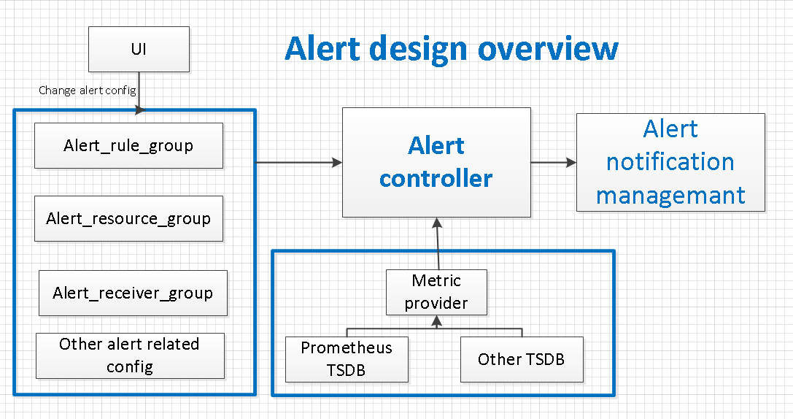
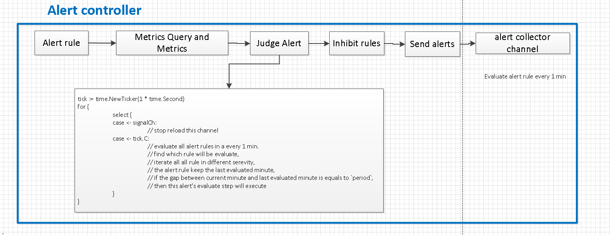
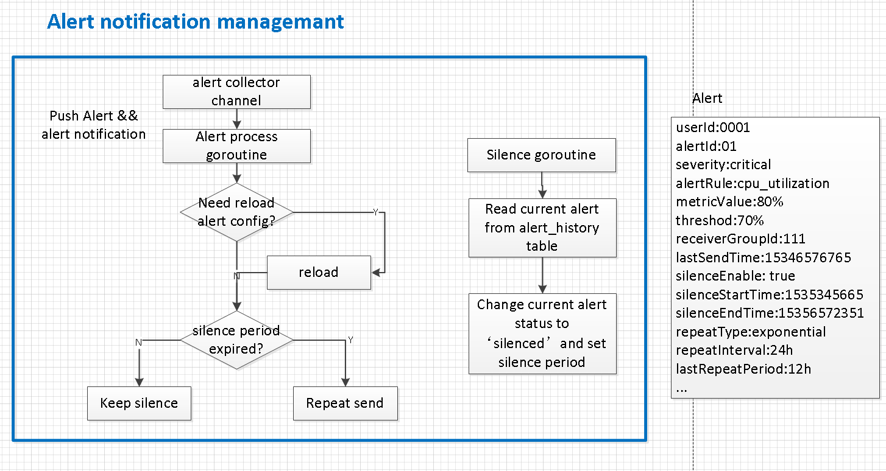
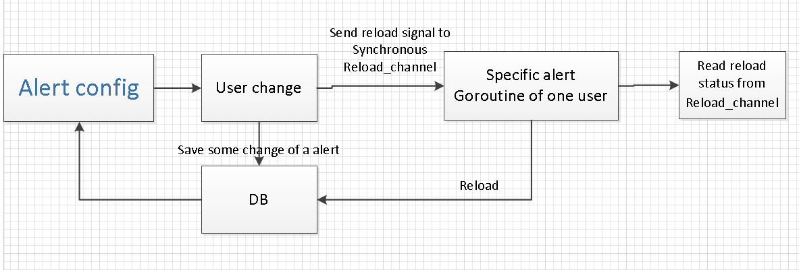
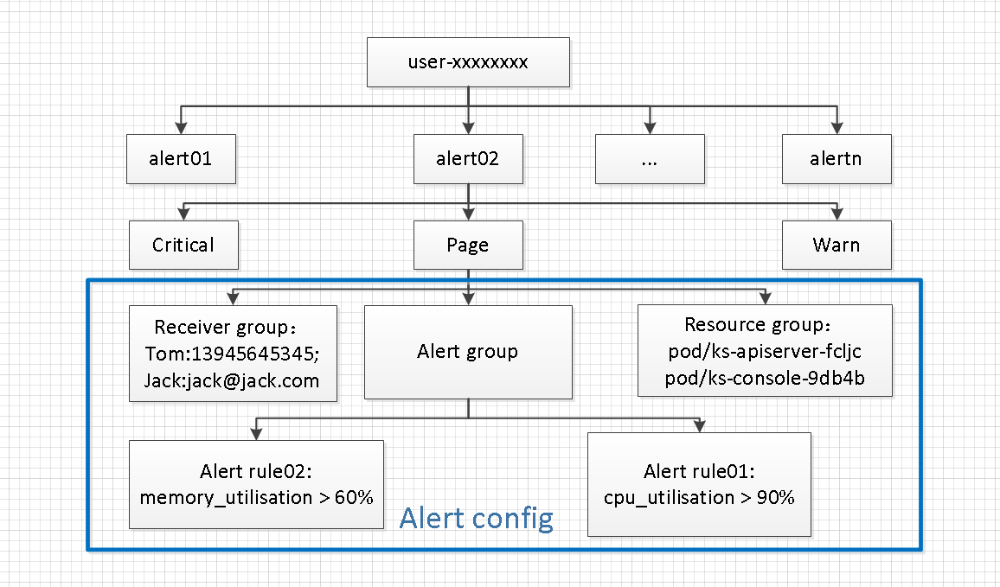

## KubeSphere Alert Design 
----
----
整体上可以分为2个模块：告警控制和告警通知模块
告警控制模块：查询监控指标是否触发告警，并将已经触发的告警发送到告警通知模块
告警通知模块：告警何时发送

告警管理模块：主要实现触发 alert 的逻辑

告警通知模块：接受告警控制模块的alert，判断何时发送alert，该模块实现 alert 的重复发送(repeat send) 和 静默(silence)功能。

更改告警相关的配置（资源组、告警组、通知人组等），告警控制模块及时 reload 配置并生效，使用无缓冲的通道实现与UI同步

用户配置的告警模型

