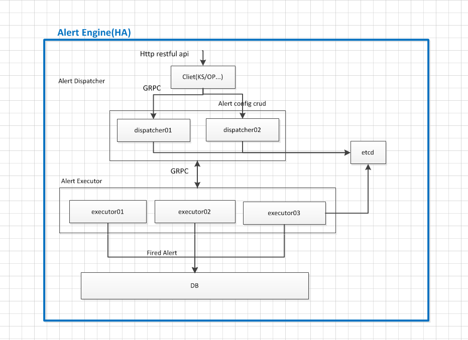

## KubeSphere Alert Design 
----
----
整体上可以分为2个模块：告警控制和告警通知模块
告警控制模块：查询监控指标是否触发告警，并将已经触发的告警发送到告警通知模块
告警通知模块：告警何时发送

告警引擎模块:

Alert scheduler 主要作用有两个：负责管理集群中的节点以及转发 alert 相关的请求，通过简单的心跳机制，获得集群中节点的状态与资源使用情况，通过查询alert_binding表，将 alert 的curd请求转发到对应的节点上，Alert scheduler 对外提供 HTTP RESTful API，内部通过 GRPC 调用各处理节点的服务。
Alert executor 为判断 alert 是否触发模块，每个alert config(resource group) 对应一个 goroutine，业务逻辑使用规则引擎处理。

告警通知模块：接受告警控制模块的alert，判断何时发送alert，该模块实现 alert 的重复发送(repeat send) 和 静默(silence)功能。

Alert scheduler 的主要作用：
节点不可用时， Alert 的迁移； 增加节点后， 负责集群整体的负载均衡；还负责 Alert 的 crud 操作的请求路由。

集群 goroutine 的健康检查：
通过对比map存储的 alert 配置文件版本与 alert_binding 表存储的alert 配置文件版本比对，回收 goroutine 和 启动 goroutine。 

客户端创建 alert 的流程，通过查询监控系统获得用户有权看到的资源列表，以供用户配置 alert。客户端用一张表保存用户与 alert config 映射关系。

若客户查看 当前正在告警的 alert，首先需要在客户端获得 该用户配置所有的 alert config id，然后使用alert config id 去告警服务中获取正在告警的 alert。

设计成公共的服务，对接多个 客户端 (KS, OP) ,不保存用户信息

