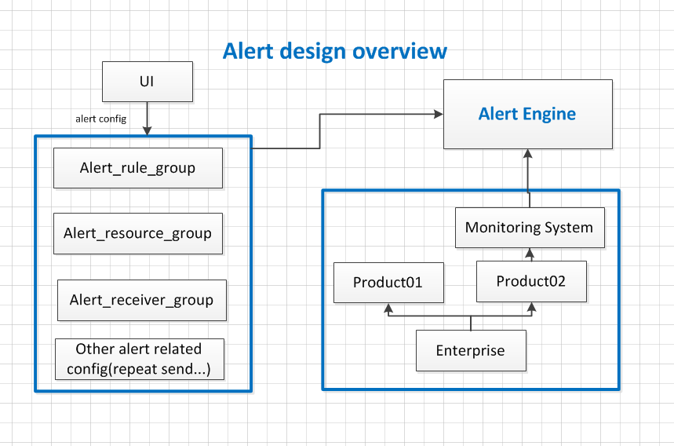
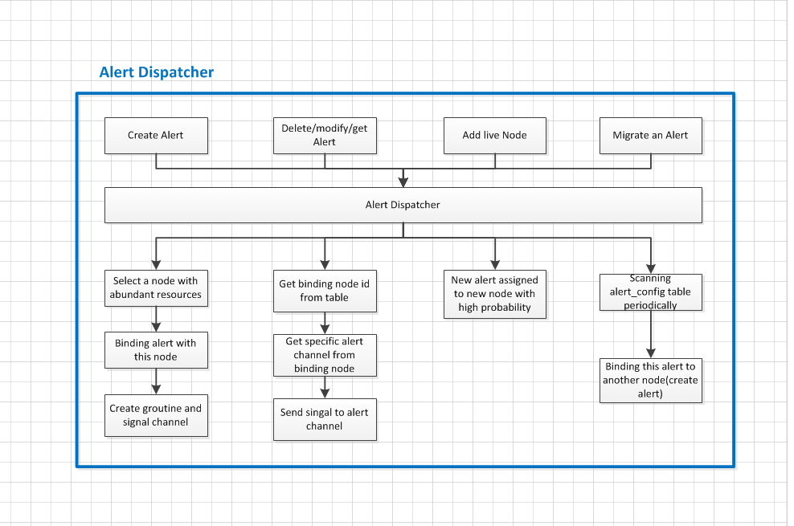
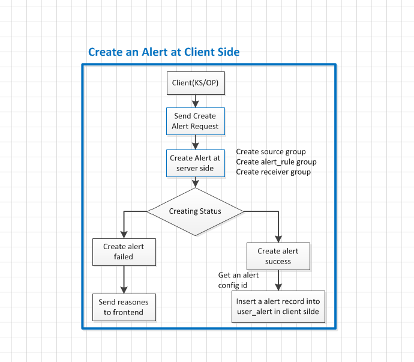
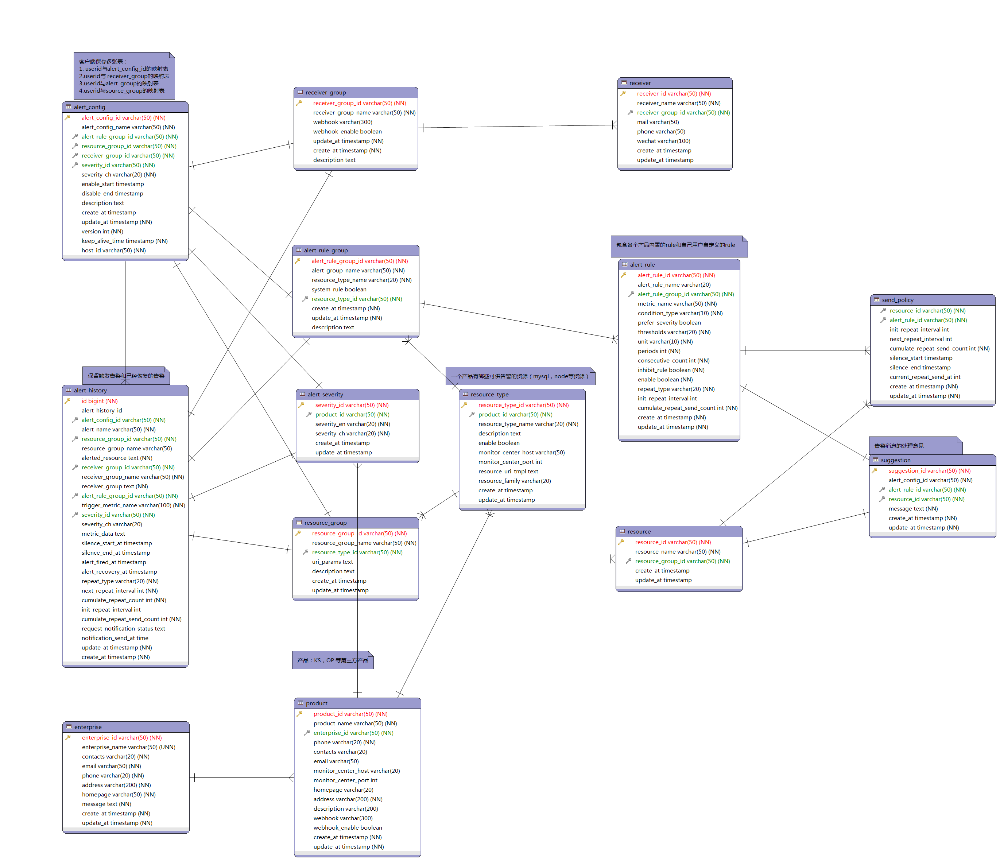

## Alert Design 

----
----

### Alert Design Overview

- 整体上可以分为2个模块：告警引擎(Alert Engine) 分发器模块 (Alert Dispatcher) 和告警执行器模块 (Alert Executor)



### Alert Client Registration Processes

设计成公共的服务，对接多个 客户端 (KS, OP)



### Alert Engine:

Alert Engine 主要作用有两个：负责管理集群中的节点以及转发 alert 相关的请求，利用 etcd 保存当前存活的节点，通过查询 etcd 获得集群中节点的状态与资源使用情况，通过查询 alert_binding 表，将 alert 的 curd 操作转发到对应的节点上，Alert Engine 对外提供 HTTP RESTful API，内部通过 GRPC 与各告警处理节点联络。
Alert executor 为判断 alert 是否触发模块，每个节点对应一个 Alert executor，每个alert config 对应一个 goroutine。



### Alert Dispatcher

负责集群整体的负载均衡, 负责 Alert 的 crud 操作的请求路由。



### Alert Executor

接受告警控制模块的alert，判断何时发送alert，该模块实现 alert 的重复发送(repeat send) 和 静默(silence)功能。



### 创建 alert 的流程

客户端创建 alert 的流程，通过查询监控系统获得用户有权看到的资源列表，以供用户配置 alert。客户端用一张表保存用户与 alert config 映射关系。



### Goroutine health check

集群 goroutine 的健康检查：通过对比map存储的 alert 配置文件版本与 alert_binding 表存储的alert 配置文件版本比对，回收 goroutine 和 启动 goroutine。 



### DB Design

